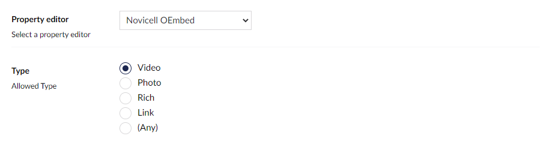

## Data Type Definition Example

### Type
Defines validation for the selected media type. Note that the selected Type is used for **backoffice validation only** - there is still only one model/response to deal with everywhere else.

OEmbed requests typically respond with whatever type of content it provides. While Video, Photo and Link may be (relatively) self explanatory, there are few more options in there.

#### Rich
The Rich type is for rich (HTML) content not fitting into any of the other Types/categories. The tweet in the screenshot below could be one example (even though in the screenshot it's actually used in an editor allowing Any type).

#### Where's the Any type?
Forgive the pun. There _is_ an "Any" type, but what does it mean? Well, the Any type simply means that there is no type validation in the editor. Anything goes.

## Content Example
